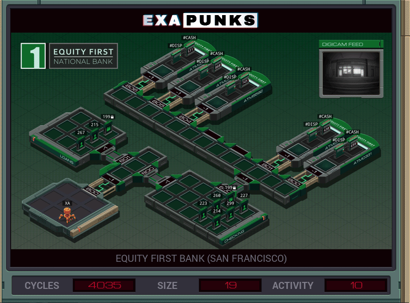
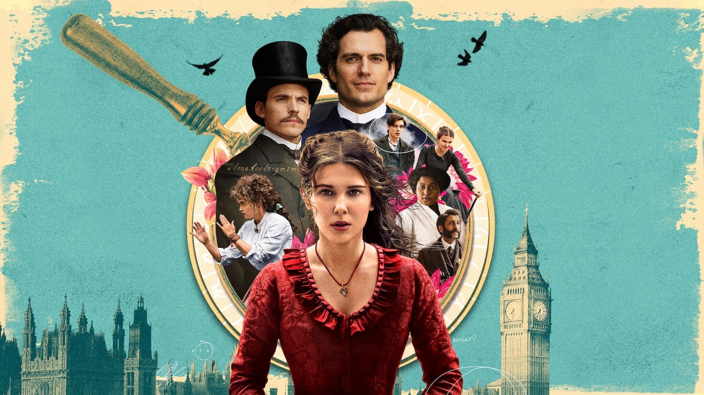
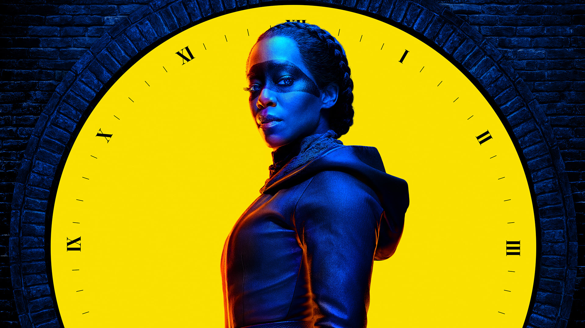
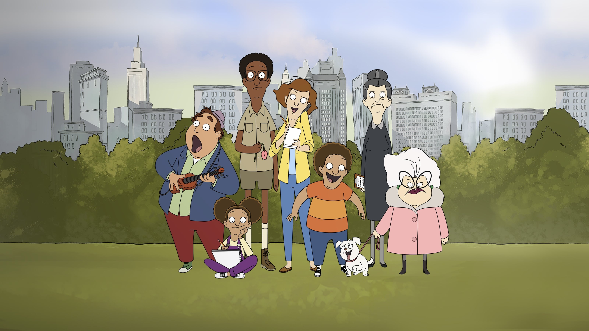
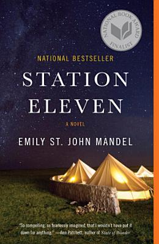
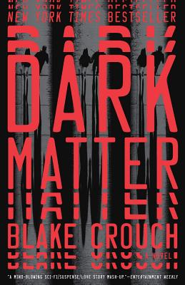
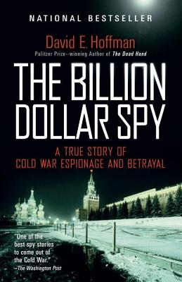

2020 was an odd year for media consumption, for obvious reasons. While there's a lot to say about the year that was, you don't need that from me.

This is my 5th annual (!!) favorite media of the year post. I like to take the time to celebrate my favorite movies, books, games, and shows that I've experienced in the preceding 12 months. I hope you enjoy reading it as much as I enjoyed putting it together.

Without further ado, the rules:

- Any book/game/movie/season of TV that I finished for the first time during calendar 2020 is eligible
- Everything is graded on my [4 point scale](/blog/post/on-the-rating-of-media/)
- All of the winners scored a 4/4. Honorable mentions may not have, but did something unique or special worth mentioning [^1]

As always, I track all the media in [Airtable](https://airtable.com); each section links to the full list of nominees if you want to see the full list of ratings and micro-reviews for each category. Let's get to it!

<h6 id="TOC"></h6>

**Table of Contents**

<!-- START doctoc generated TOC please keep comment here to allow auto update -->
<!-- DON'T EDIT THIS SECTION, INSTEAD RE-RUN doctoc TO UPDATE -->

- [Videogames](#videogames)
- [Movies](#movies)
- [Television](#television)
- [Books](#books)
- [Updates](#updates)
- [The List](#the-list)

<!-- END doctoc generated TOC please keep comment here to allow auto update -->

## Videogames

Across 12 months, I played 58 games (beat 46 out of 53 beatable games) for a total clock time of 674 hours (up from 42 games in 612 hours in 2019).

After returning home from travels, I built a gaming rig.[^2] It came with a few free months of Microsoft's Game Pass service, giving me unlimited access to a host of PC games. It's not for everyone, but as someone who plays most games just the once, it was perfect for me. It let me try lots of games I had had my eye on on without having to buy them all; very awesome.

---

### EXAPUNKS

Longtime readers of this series will know that I'm a sucker for Zachtronics games. They encapsulate the enjoyable parts of my programming passion (puzzle solving, incremental improvements) without any of the downsides (workplace politics, unclear business requirements, etc). In my 2018 post I wrote about _Opus Magnum_, which was an evolution to the _Space Chem_ visual programming formula. Similarly, [_EXAPUNKS_](https://www.zachtronics.com/exapunks/) follows in the tracks of _TIS-100_ and _SHENZHEN I/O_ as a very code-heavy game. Like OM, it ditches the line-of-code and number-of-pieces restrictions in favor of self-imposed challenges. This opens the game up dramatically, allowing players to stop anywhere in the path of "make it work, make it fast, make it pretty".

Theme wise, it's a slam dunk. It wears its _Hackers_ inspiration on it sleeve and there's a great "stick it to the man" vibe running throughout. One level finds you hacking a console to break the DRM chip, which felt appropriately on brand. It also continues the Zachtronics streak of "having just enough story to thematically unite the game" without bogging the player down with following a complex plot. They once again released buyable [physical reference materials](https://store.steampowered.com/news/app/716490/view/2182502958249872196) which bring fun physicality to a digital game.

_[Exapunks](https://www.zachtronics.com/exapunks/) is available on most PC storefronts_

---

### Carto

There's a lot to like about _Carto_. Some will gravitate to the charming art style, the cute writing, or the pleasant music. For me, it was the ingenious gameplay.

_Carto's_ core gameplay loop involves manipulating the tiles that comprise the world map. They can be moved and rotated freely in order to solve puzzles. For example, arranging tiles to form a lake so characters can have a fishing competition. On its own, that's very cool, but probably wouldn't carry an entire game. Luckily, developer [Sunhead Games](http://www.sunheadgames.com) kept surprising me with novel spins on this concept. Pair that with some great secrets to find and all of the great bits I mentioned at the start, and you've got a heck of a game.

_Carto is available on computer and all major consoles_

---

### Hades

Being one of the biggest releases this year, you've probably heard a lot about [Hades](https://www.supergiantgames.com/games/hades/) at this point. Bear with me just a little longer as I delve into what made the game special for me: its dynamic narrative and its attention to detail. After I'd clocked ~ 35 hours across 36 escape attempts, it struck me that I hadn't heard a single repeated line of dialogue. Not a single one. Any time you talk to a character, they've got something new to say. Typically, their lines are based on who else you've talked to recently. During a run, the second god you talk to usually comments on your run-in with the first ("Oh, I see you met my brother Zeus. He...") or your chosen weapon ("oh, I recognize that sword! It..."). NPCs at the home base may discuss house gossip (that you would have heard about recently) or the result of your last run. Everyone oozes character via both their visual style and voice performances. That each player experiences hyper-specific dialogue based on their game is nothing short of a technical marvel. I'm wickedly curious about how they do it. When you're not battling monsters, you can wander the house chatting up its denizens. Each character has their own story that unfolds through repeated conversations. For instance, Orpheus pines for Eurydice. When you run into her during escape attempts, you can relay his messages. True dedication to this yields a rich, interconnected story.

Past that, the gameplay is great. It can get a little repetitive (and would benefit from some extra enemy variety), but moving and attacking is fluid enough that you forgive it. Plus, the gear and boons you pick up on each run are unique enough that the minute-to-minute action doesn't get stale. More often than not, focusing on trying new things rather than tried-and-true powers leads to surprise and delight. My only big complaint is one shared with other "[roguelikes](https://en.wikipedia.org/wiki/Roguelike)" (such as _Slay the Spire_). If I'm in the mood to play a specific build (such as an Artemis cast build, or a poison deck in StS), there's not an easy way to go out and do that. But, dang it if the game isn't fun enough to overlook that. The music is also superb (as is the case for all their games). Supergiant games knocks it out of the park once again.

_Hades is available on [Steam](https://store.steampowered.com/app/1145360/Hades/) and [Switch](https://www.nintendo.com/games/detail/hades-switch/); I played on Switch._

---

### Honorable Mentions

- **Dishonored 2**: The gameplay, as always, is great. The level design, as always, is the crown jewel. The levels are small and dense, with many avenues to success. Developer _Arkane_ builds quite a world.
- **Frostpunk**: The game is fun, but what really made it stand out to me this year was the desperation and hopelessness I felt when a game was going sideways. I only played through the campaign twice (once poorly and then once successfully). I was pleasantly surprised at the emotional reaction elicited from me. I was sad for my survivors, hoping they could just hold on a little longer before I could shepherd them to safety. I don't usually have reactions like that, so the fact that I did earned this game's place in the honorable mentions.
- **Death Stranding**: Kojima _really_ needs an editor; this story was a mess. But, it had a deeply original gameplay loop: you really just walk around and make future walking around easier. Building roads and zip lines was deeply satisfying; I'd play a whole game that was just building infrastructure you can use later. The collaborative yet distant spin on multiplayer was revolutionary. What put it over the edge was playing it during lockdown. A core goal of "building connections between isolated people" hit differently this year.
- **Hypnospace Outlaw**: More than any other game, they nailed the design and tone of the early 90's web. Spelunking through sites to discover the story was a delight. But, it's a _lot_ of reading, which can be a mixed bag. Great audio-visual presentation though.
- **Deliver us the Moon**: This game is light on the gameplay, the vibe is great. You're exploring an abandoned moon base and fixing problems as you go. The story is presented via text and audio logs, which works in the sci-fi setting. There are effective zero-g sections, always a delight. The scenes end up being a series of [space mistakes](https://www.youtube.com/watch?v=FBFuiHZRylY), but it works.

---

_see the full list of games I played during 2020, including ratings and reviews, on [Airtable](https://airtable.com/shriNUdBSKVIKjw3f)_

_return to the [table of contents](#TOC)_ ↩️

## Movies

In calendar 2020, I saw 227 movies total; 102 of those were first-time views, _0_ were in a movie theater.[^3] This was our daily quarantine hobby. We watched a lot of series and almost nothing pandemic-themed.

---

### 13th

The biggest obstacle for a cogent discussion of American racism is the sheer scope of the topic. It's easy to point to individual racist acts, but that's only ever a sliver of the story. Racism is woven into the very fabric of this country and it takes a master's hand to capture and connect that scope; director Ava DuVernay rises to that challenge. The film's far-reaching narrative connects events from the Civil War all the way up to today; no small feat. Watching this won't make you feel _good_, but it paints the big picture, which is vital to understanding the crushing weight that our fellow Americans experience daily.

Honestly, there's not much else I can say that will do this movie a modicum of justice. It's available on Netflix, but the whole thing is available for free on YouTube:

<YoutubeEmbed youtubeId="krfcq5pF8u8" />

If you're interested in learning more about the wide-ranging scope of racism, Ta-Nehisi Coates' ["The Case for Reparations"](https://www.theatlantic.com/magazine/archive/2014/06/the-case-for-reparations/361631/) does a great job providing background information on how we got where we are today.

---

### Enola Holmes

I was raised on a steady diet of detective mysteries and this is a great one. The plot is good, but the presentation and cast is great. I liked her talking directly to the audience. The pacing and music were great and it had some genuinely laugh out loud moments. Millie Bobby Brown can absolutely carry further movies and I'm excited to see where they take future films.

_Enola Holmes is available on [Netflix](https://www.netflix.com/title/81277950)_

---

### Honorable Mentions

- **Palm Springs**: I've always had a soft spot for time loops, and this one is good. A fresh spin on the time loop trope paired with a superb cast and Samberg's comedic stylings, makes _Palm Springs_ an easy-to-watch romp with plenty of heart.
- **The Way I See It**: This documentary is a powerful inside look at the Obama administration from its chief photographer, Pete Souza. Politics aside, there's a lot to learn about the inner workings of the presidency itself.
- **Death to 2020**: Literally the last movie I watched in calendar 2020, and it was a great send-off. It's a dry _dry_ mockumentary about the year that was. It doesn't overstay its welcome and there are some standout jokes that really stuck with me.
- (dishonorable) **Wonder Woman 1984**: I enjoyed the first _Wonder Woman_ and was cautiously optimistic going into this one. My open mind was rewarded with an uncomfortable plot, cut-rate physics, and a climax that didn't believe in itself. The opening sequence is cool though, and Pedro Pascal is a gem.
- (dishonorable): **Fast and the Furious: Tokyo Drift**: We reached a point in quarantine that we thought it would be a good idea to watch all the Fast & the Furious movies.[^4] What can I say, we all coped in our own ways. Despite having the worst naming scheme of any long-running series, there were a few good movies in there (_F8_ being the best). On the other end was the third installment, _Tokyo Drift_, an absolutely indefensible movie. Looking past the weird white savior vibe, the characters are unlikable and the plot is both spread too thin and boring.

---

_see the full list of movies I watched during 2020, including ratings and reviews, on [Airtable](https://airtable.com/shrbuviZkQnxzxJ9Y)_

_return to the [table of contents](#TOC)_ ↩️

## Television

This year, I finished 30 seasons for the first time (up from 29 last year).

---

### Ted Lasso

When I first heard they were making a full show out of that silly Premiere League commercial, I never thought it would work. Well boy _howdy_ was I wrong.

<YoutubeEmbed youtubeId="6KeG_i8CWE8" />

_Ted Lasso_ provided a vital ray of sunshine this year. Created by Bill Lawrence of _Scrubs_ [^5] fame, _Lasso_ provides the the same ensemble energy that made _Scrubs_ work so well. Sudeikis' Lasso is a protagonist that succeeds by building up those around him and dang if that's not just what the doctor ordered. Despite the positive vibe, the show doesn't stray from tougher issues. We explore Lasso's troubled home life and serious inter-personal issues among his players. He approaches it all with [an Enthusiasm Unknown to Mankind](https://twitter.com/CoachJim4UM/status/555691876012281856), and it doesn't always work; that's life. While the series' comedic highs are are the obvious focal point, the emotional depths the show reaches in the meantime are truly an experience.

I don't care a whit about soccer but you owe it to yourself to watch _Ted Lasso_.

_Ted Lasso is available on [Apple TV+](https://tv.apple.com/us/show/ted-lasso/umc.cmc.vtoh0mn0xn7t3c643xqonfzy)_

---

### Watchmen

Optimistic fans are usually wise to be apprehensive about remakes, reboots, and spinoffs of their favorite series. But occasionally their optimism is rewarded, and in this case rewarded it was. 2019's _Watchmen_ does a superb job expanding and adapting the universe presented in [the 1986 graphic novel](https://en.wikipedia.org/wiki/Watchmen). It takes place in an alternate 2019 (following the events of the novel's alternate 1985) and speaks to many current issues, most prominently racial violence and police brutality. Through the show's nine episode run, we mostly follow Angela (Regina King), an undercover cop fighting a growing white nationalist movement. We also get backstory about the ensemble: her partner on the force; a mysterious old man; and an eccentric recluse with the castle full of clones. Despite its far-ranging plot threads, the story told is a _tight_ one, never wasting a minute of screen time.

It's hard to understate the show's present-day relevance. Besides the aforementioned takes on the role of police, _Watchmen_ had the dubious honor of introducing most of white America to the [Tulsa race massacre](https://en.wikipedia.org/wiki/Tulsa_race_massacre); the sudden attention got the event added to the Oklahoma public school curriculum.

All said, _Watchmen_ had no right to be as good as it is. But it is, and we are all the better for it.

_Watchmen is available on [HBO](https://www.hbo.com/watchmen). It's a sequel to the comic, so I recommend [reading the original material](https://www.goodreads.com/book/show/472331.Watchmen) before you watch._

---

### Central Park

As a long-time _Bob's Burger's_ watcher and general musical fan, it didn't take much convincing to get me on board for _Central Park_. It's got a stacked main cast with Kristen Bell, Titus Burgess, Daveed Diggs, Josh Gad, Kathryn Hahn, Leslie Odom Jr., Stanley Tucci, and many superb guests stars. It follows a family who live in the heart of Central Park as they work to stop a plot that would see their park sold to corrupt real estate mogul Bitsy Brandenham (Tucci). This overarching plot gives a through-line to the season that _Bob's Burgers_ typically lacks, a welcome change.[^6] The songs are toe-tappers and don't overstay their welcome. The jokes are rapid, sometimes 4th-wall breaking (love that), and well-written. It also captures (to my uninformed eye) the general weirdness of the people of New York. They come from all over, in all walks of life, and this show helps bring that to the screen.

_Central Park is available on [Apple TV+](https://tv.apple.com/us/show/central-park/umc.cmc.4qe3i11erof30x0vz8nwnjkw3) and the soundtrack is on all major streaming services_

---

### Honorable Mentions

- **Hasan Minhaj: Homecoming King**: When watching comedy specials, I prize cohesion most dearly. Dave Chappelle is great at this: retelling a collection of disparate anecdotes that all tie together at the last moment. Minhaj does that exceeding well, layered with heartfelt and hilarious stories about his life. One of the best stand-up specials I've seen in years.

---

_see the full list of TV seasons I watched during 2020, including ratings and reviews, on [Airtable](https://airtable.com/shrl3XScK4dtGDV2z)_

_return to the [table of contents](#TOC)_ ↩️

## Books

I finished 19 books this year, up from 15 the year before. All were read on my trusty [Kobo Clara](https://www.nytimes.com/wirecutter/reviews/amazon-kindle-is-the-best-ebook-reader/#a-non-amazon-option-kobo-clara-hd), which I [gushed about in another post](/blog/post/an-ode-to-kobo/) this year.

---

### Station Eleven

Emily St. John Mandel's [_Station Eleven_](http://www.emilymandel.com/stationeleven.html), a journey through the arrival and aftermath of a pandemic, had been on my list for ages. 2020 seemed a good a time as any to dive in. It opens in the first few weeks of a deadly pandemic describes and fear and uncertainty of that time. I read it in early December, but the parallels to our March were uncanny. Incredibly, Mandel wrote it in 2014.

I loved how it detailed exactly what goes wrong when society collapses. The bulk of the story takes place 20 years after the "Georgia Flu" arrives (from the country, not the state). Electricity is a thing of the past, as are motorized transportation and bullets. Crude settlements have popped up around the country and the plot follows a traveling orchestra troupe striving to bring light to the world. If I had to describe the book in a word, it would be _intricate_. It tracks a large ensemble of characters across the years between the time before the pandemic, the onset, and its later years. We see them all in different stages of their lives; across marriages and divorces, joy, fear, hard choices, and uncertainty. Each character is connected to many others, often in unexpected and delightful ways. This dense, satisfying web is the very one that books like [_Cloud Atlas_](https://www.goodreads.com/book/show/49628.Cloud_Atlas?from_search=true&from_srp=true&qid=assnimdlHx&rank=1) and Christopher Priest's [_The Adjacent_](https://www.goodreads.com/book/show/17256056-the-adjacent) strive to build; none do it so well. Best of all, it's written non-linearly, and masterfully so. Somehow, you care about every single person (a tall ask with an ensemble). It's a book about equal parts death and life; connection and isolation. Maybe now, more than ever, is the time for this book.

And hey, I get it. If you aren't in the mood to taint your pandemic escapism time with a novel about a pandemic, I absolutely understand. But, I pick my media awards carefully and with reason. It's oddly comforting that this wasn't written in the present day and might just be the thing you're looking for.

---

### Dark Matter

My favorite thing about time loop stories is learning how differently a story plays out with minor tweaks; see also: [_Run Lola Run_](https://www.imdb.com/title/tt0130827/) and well, [aforementioned](#honorable-mentions-1) _Palm Springs_. Blake Crouch's [_Dark Matter_](https://www.blakecrouch.com/dark-matter.php) does a similar thing, but with alternate versions of protagonist Jason Dessen's life. What if he hadn't met his wife, or they hadn't hit it off? Past that, the story explores the very nature of self. Our Jason is just one version of many- what makes him the real one? Is he? _Dark Matter_ is a seat-of-your-pants thriller that's more than the sum of its parts.

---

### Billion Dollar Spy

The best thing about this fantastical spy thriller is that it's 100% non-fiction (with citations). David E. Hoffman's [Billion Dollar Spy](https://www.davidehoffman.com/the-billion-dollar-spy/) recounts the goings-on at the US spy headquarters on Moscow during the height of the Cold War. What follows is a deep-dive into the mechanics of managing informants, dropping tails, paying assets securely, and carefully considering the value and validity of their intel. It's a gripping read that explores elements of spycraft I had never considered. The world is always in need of more fictional spy thrillers. Unsurprisingly, thrilling non-fiction is even more exciting.

---

### Honorable Mentions

- **Senlin Ascends**: Great characters, good plot, _superb_ world building. A lot of thought was given to how a fully functioning society would operate in the confines of a tower. I haven't read the rest of the tetralogy yet, but it feels a bit like a vertical _Snowpiercer_, which is awesome. Also, the eponymous Senlin has an awesome arc through the first book, evolving from a stodgy schoolteacher to... well, not that.
- **This is How You Lose the Time War**: I thought the story here was good, but the writing style and frame really set it apart. It's an [epistolary story](https://en.wikipedia.org/wiki/Epistolary_novel), one told entirely through letters. Specifically, letters between rival time-traveling operatives (and written by two different authors in real life). A very cool love story is painted between the lines. I could have used a little more plot resolution, but it was a fascinating way to write a book

---

_see the full list of books I read during 2020, including ratings and reviews, on [Airtable](https://airtable.com/shr16kGKrEAjL5LXl)_

_return to the [table of contents](#TOC)_ ↩️

## Updates

A quick list of how my [picks from last year](/blog/post/my-favorite-media-of-the-year-2019-edition/#movies) aged:

- _Red Rising_ trilogy stuck the landing, was great
- We got _Knives Out_ on iTunes and watched both the director's commentary and the making-of documentary; both are great
- _The Mandalorian_ S02 was great
- I didn't watch _American Gods_ S02, but I didn't hear good things
- _Slay the Spire_ has spawned a number of well-received copycats, if you liked that formula.
- _Celeste_'s protagonist was confirmed as [canonically trans](https://maddythorson.medium.com/is-madeline-canonically-trans-4277ece02e40) and her creator talks about their experience designing games
- _Tuca & Bertie_ was [renewed](https://www.theverge.com/2020/5/22/21267667/tuca-and-bertie-season-two-adult-swim-netflix-renewed-saved-bojack-horseman-lisa-hanawalt) after its cancellation!

## The List

- Games
  - [EXAPUNKS](https://www.zachtronics.com/exapunks/)
  - [Carto](https://www.igdb.com/games/carto)
  - [Hades](https://www.supergiantgames.com/games/hades/)
  - Honorable Mentions:
    - [Frostpunk](https://www.frostpunkgame.com)
    - [Dishonored 2](https://bethesda.net/en/game/dishonored2)
    - [Deliver Us the Moon](https://www.deliverusthemoon.com)
    - [Hypnospace Outlaw](http://www.hypnospace.net)
    - [Death Stranding](https://en.wikipedia.org/wiki/Death_Stranding)
- Movies
  - [13th](http://www.avaduvernay.com/13th)
  - [Enola Holmes](<https://en.wikipedia.org/wiki/Enola_Holmes_(film)>)
  - Honorable Mentions:
    - [Palm Springs ](<https://en.wikipedia.org/wiki/Palm_Springs_(2020_film)>)
    - [Death to 2020](https://en.wikipedia.org/wiki/Death_to_2020)
    - [The Way I See It](<https://en.wikipedia.org/wiki/The_Way_I_See_It_(film)>)
  - Disonorable Mentions:
    - WW84
    - FF: Tokyo Drift
- TV
  - [Ted Lasso](https://tv.apple.com/us/show/ted-lasso/umc.cmc.vtoh0mn0xn7t3c643xqonfzy)
  - [Watchmen](https://www.hbo.com/watchmen)
  - [Central Park](https://tv.apple.com/us/show/central-park/umc.cmc.4qe3i11erof30x0vz8nwnjkw3)
  - Honorable Mentions:
    - [Hasan Minhaj: Homecoming King](https://en.wikipedia.org/wiki/Hasan_Minhaj:_Homecoming_King)
- Books
  - [Station Eleven](http://www.emilymandel.com/stationeleven.html)
  - [Dark Matter](https://www.blakecrouch.com/dark-matter.php)
  - [Billion Dollar Spy](https://www.davidehoffman.com/the-billion-dollar-spy/)
  - Honorable Mentions:
    - [Senlin Ascends](http://www.thebooksofbabel.com)
    - [This is How You Lose the Time War](https://www.goodreads.com/book/show/43352954-this-is-how-you-lose-the-time-war)

## TTFN

Thank you for reading! As always, I have a blast putting this list together. Let me know what you think (or if you've got any recommendations based on what I liked).

_This post was edited expertly and patiently by [Vicky Stein](https://vickystein.media/)._

[^1]: I can almost always find something interesting or worthwhile about a piece of media, even an otherwise bad one
[^2]: unsurprisingly, a tower is more suited for home life than the road
[^3]: maybe next year
[^4]: In 5 days, no less
[^5]: Another longtime favorite of mine
[^6]: There's place for both styles in the world, but I personally enjoy a goal the characters can work towards
