We're fast reaching the climax of the most ambitious film projects ever conceived: 18 movies over the course of 10 years, ranging from "really good" to "I wish they hadn't made this, but here we are". To properly prepare myself for _Infinity War_, I went back and watched the entire canon of MCU movies. It was the perfect opportunity to compile my personal power ranking for all 18 films, which I'm pleased to present to you now.

While building this list, I watched each movie in order. Movies were judged loosely on categories such as humor, action, cohesiveness, and writing. Then I decided where it fit in based on those I had watched already.[^1] All movies I watch fall into one of four categories: Awful, Bad, Good, and Great, which is also how I bracketed these. You probably won't agree with everything, but this is my list. If you need a refresher of what all the movies are, check out [Wikipedia](https://en.wikipedia.org/wiki/Marvel_Cinematic_Universe#Feature_films).

Without further ado, from worst to best, here's every Marvel Cinematic Universe film (so far).

**NOTE: EXTREME SPOILERS** for all (pre-_Infinity War_) Marvel movies follow. Proceed at your own risk!

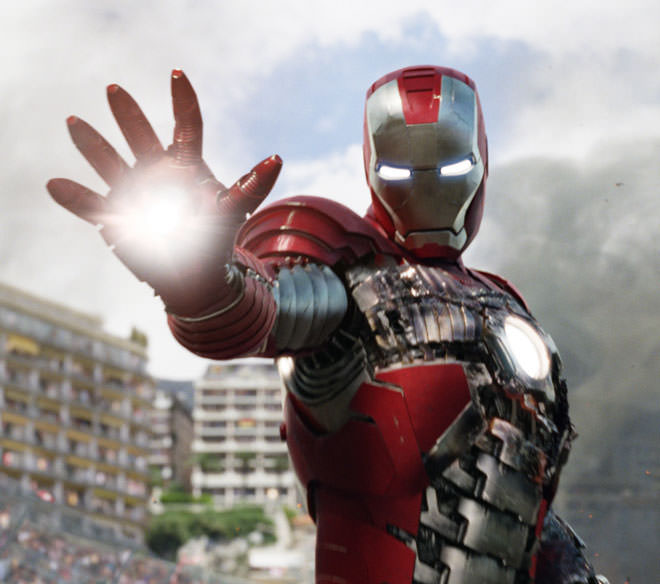

## The Bad

With 18 films, there are bound to be some stinkers. For whatever reason, the following movies just don't stand up to the rest (or even as films as a whole).

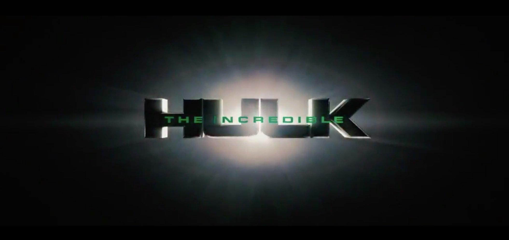

### 18. The Incredible Hulk

Every series has its worst one, and I'm glad we got the MCU's out of the way early. Watching it now, I can see what they're going for. They've got Ed Norton, a great actor. They do the "monster movie" right by not really showing him until the end. There are some cute cameos and they reference Iron Man on a TV crawl. On the other hand, despite having a great leading actor, they do a lot of the storytelling via chat logs and the whole thing starts with a 3 minute flashback zooming (at high speed) how the Hulk was created. Plus, the animation hasn't aged well and it's hard to care about him or his lady-friend. A well deserved spot at the bottom of the list.

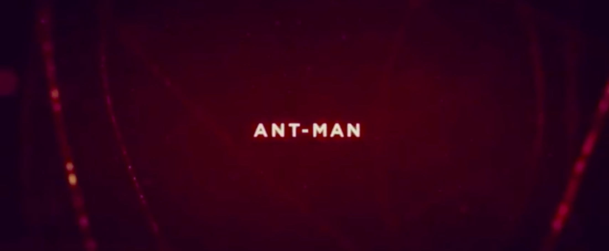

### 17. Ant-Man

Let me start by saying - I like Paul Rudd. He's a good actor and seems like a chill dude. That's why it pains me to see him flounder so spectacularly here. The tone is inconsistent (some of the family drama is _very_ dramatic while everything else is pretty light). Michael Peña is hilarious, but we didn't get enough of him. There's an incompetent sub-villain in the ex-wife's husband and the character who is presumably the female lead feels like an afterthought. There's really only one good fight scene (the climax in the kid's bedroom is a neat backdrop!) while the rest are him running around while small. Definitely a cool perspective, but garner nothing more than a "huh, that's kind of cool". Not to mention, there's gross bugs running around the whole time. NEXT.

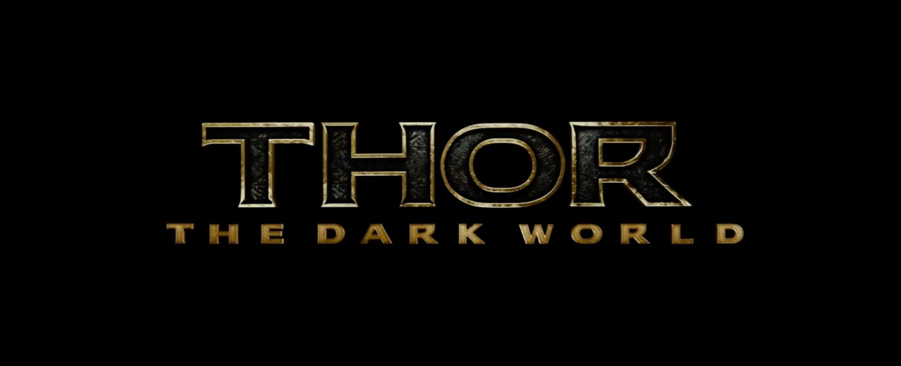

### 16. Thor: The Dark World

Let's start with the good: the sets are pretty cool and Hiddleston's Loki is a blast. Past that, this movie is thin. They took all of the worst parts of _Thor_ (the stodginess and seriousness) and just made _more_ of it. Gone is the humor where the God of Thunder is learning his way around Earth customs. Instead, we've got his prop-of-a-girlfriend Jane (played by the tragically wasted Natalie Portman) who gets powerful for a bit and honestly, that's all I can remember about it. I know they kill Thor's mom, but she also only had a line or two previous, so there's not much in terms of emotional investment. It's salvaged above the other contenders by virtue of having some half-decent fight scenes, but the villain and everything else about it is so forgettable that it's hard to be sure.

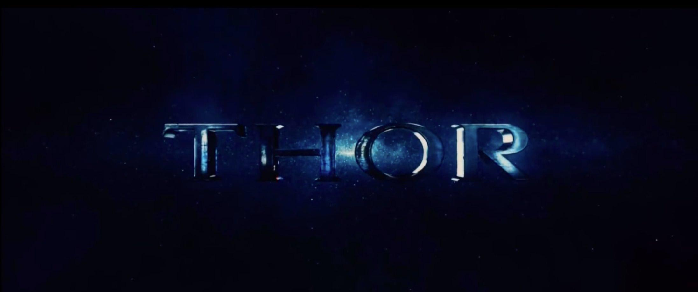

### 15. Thor

As one of the earliest movies (it was the fourth one made), it really shows its age. There's some cool worldbuilding about Asgard and the sets are more elaborate than other movies. Unfortunately for him, Hemsworth's first outing as Thor doesn't create a terribly likable character. His acclimation to earth is cute, but brief. There are multiple fights that feel like the climactic one, but none are satisfying enough (the destroyer, then Loki on Asgard). They spend a lot of time on this boring relationship between him and Jane, but the whole thing is unrealistic. I realize that's a weird complaint in a comic book movie, but suspension of belief only goes so far.

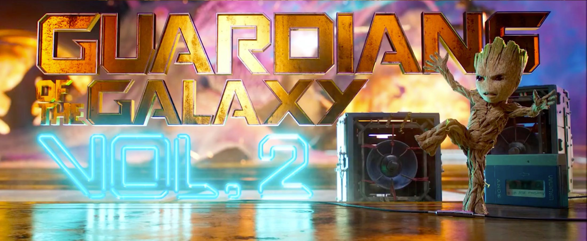

### 14. Guardians of the Galaxy Vol. 2

If you've ever wondered how many competing storylines can fit in a movie, look no further. This 2 hours is _busy_. Some of the arcs (the Ravagers, Drax // Mantis) are awesome and/or emotional while others (Star Lord & his daddy issues, Gold People) feel necessary, but unfulfilling. Nebula doesn't do a lot despite being an important character. Character development is surprisingly good amid a barrage of jokes (2/3 of which land). There's some cool tech, but ultimately this movie is fine.

## The Good

These are the films that start to put the pieces together and start cooking with gas. They're made up of good scenes with only a few flaws holding them back.

### 13. Iron Man

We're getting there! Now, why is a movie typically so well-regarded so far down on the list? Simply, it's _good_. There's nothing awful about it, but RDJ is so good in all of the other movies he's in that this one fails to shine. It also feels surprisingly dated. This was apparently before Marvel put a ton of time designing Stark's fantasy computers. Instead, he's rocking an [LG VX9400](./images/future_phone.png) which is there to feel futuristic and expensive but now comes off antiquated. He's got a landline phone and makes jokes about MySpace. For all that, Bridges is an awesome villain and there's some good humor as he's building the first suits. Marvel has done worse, but they've certainly done better since.

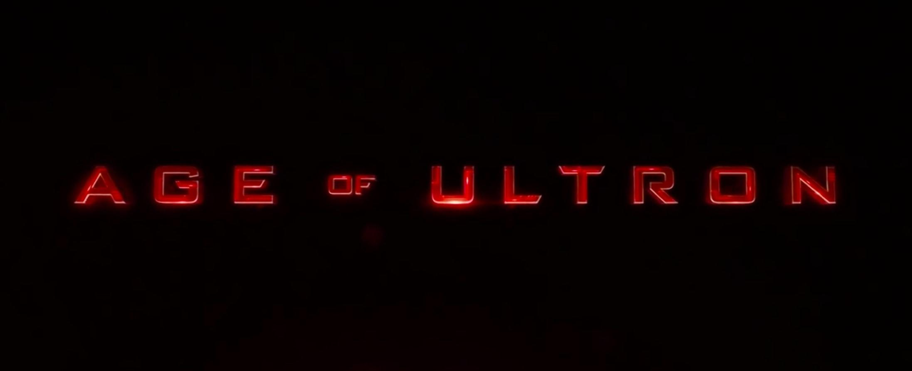

### 12. Avengers: Age of Ultron

This movie had the impossible task of being the sequel to _The Avengers_ (which you haven't seen on this list yet because it's very good). It opens on a high note, with the already-together Avengers kicking ass. It's fun seeing them work together and there's some great freeze frames. There's good character work in each of the movie's vital "small" scenes [^2] trying to pick up the hammer and the downtime at the farmhouse. Ultron (helped by an _exceedingly creepy_ performance by Spader) is even an interesting adversary. Unfortunately, they spend a lot of screen time here setting up other MCU movies. Sometimes it's relevant (starting to emphasize personal accountability) but mostly, it's scenes that feel shoehorned in (Klaue in Wakanda, Infinity Stones in Thor's dream). Together, they make this movie feel unfocused. It definitely has its high points, but it's far from a complete package.

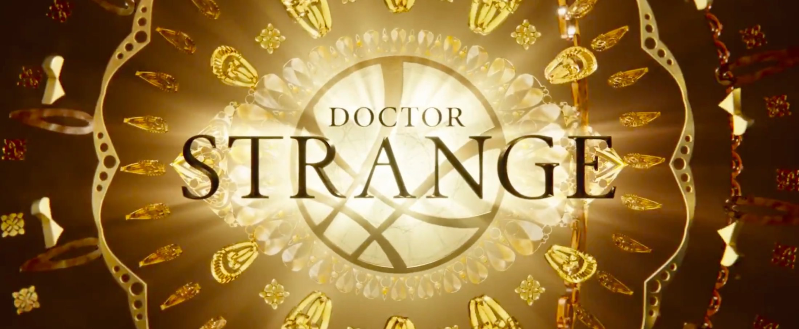

### 11. Doctor Strange

The hands down biggest thing this movie has going for it the visual effects. They really went above and beyond with the Inception-esque rotation, folding, and flattening of the world around the characters. I was pleasantly surprised at how utterly unlikable Strange is at the start and how, after seeing him get the snot kicked out of him a few times, we start to sympathize. The humor is great and his supporting cast (Wong, Ejiofor, Mikkelsen, and Swinton) really bring the whole thing together. The fight scenes are mostly hand-to-hand and choreographed well. There's definitely a lot of hand-wavy science, but given the supernatural nature of the movie, it doesn't bother me much. When it was all said and done, I was impressed by how well everything came together.

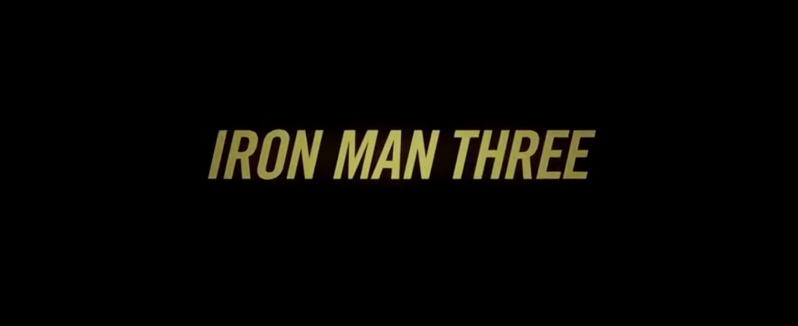

### 10. Iron Man 3

IM3 does a really interesting thing when it focuses on Tony's problems with PTSD and anxiety, an unusual trait for the lead of a huge franchise. This marks a turning point in the MCU where besides being quality action movies, the films start to explore some emotional complexity that is unusual for the genre. This is one of the few Marvel movies with an actual twist (the identity of the Mandarin, who was awesome). I felt the actual villain (the smarmy dude behind it all) was less compelling. Tony interacting with the kid was great. Unfortunately, despite getting explosion powers, Pepper doesn't feel like much more than a damsel to be rescued, which is disappointing. The action is par for the Iron Man course and as you've read, there are worse movies.

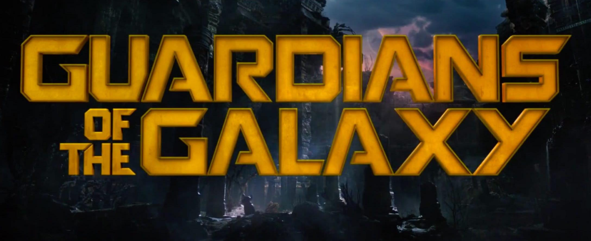

### 9. Guardians of the Galaxy

_Guardians_, like the other movies in this bracket, doesn't have any glaring faults but doesn't excel at anything. The characters are actually pretty charming and grow together well. The energy of the soundtrack is infectious and the less traditional take on the humor in a sci-fi universe grew on me. More than anything, I think this willingness to try something out of the box helped them down the line when they were looking for options to salvage the _Thor_ franchise. This also marks the first time Thanos has real dialogue during a movie. John C. Reilly has a great role and watching everyone else in the universe play the [straight man](https://en.wikipedia.org/wiki/Straight_man) to this gang of misfits is pretty fun.

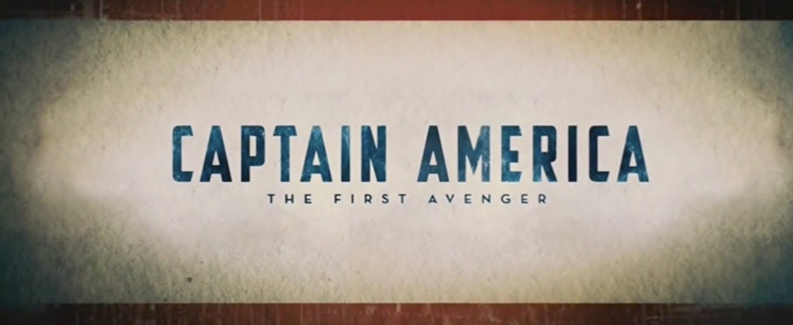

### 8. Captain America: The First Avenger

Each time I watch this, it's better than I remember. The 40's aesthetic is well done and they spend a lot of non-action scenes showing the war effort. I think my biggest gripe here is how long the setup was - between him trying to get into the army, the training, and the showboating, our first big action scene (besides a fairly satisfying chase through the streets of New York) doesn't come until much later. When we get to him, Hugo Weaving plays a great villain. A lot of good pieces and a great setup of the Cap movies to come.

## The Great

Here we have them, the cream of the crop. The following films exemplify what a Marvel movie should be.

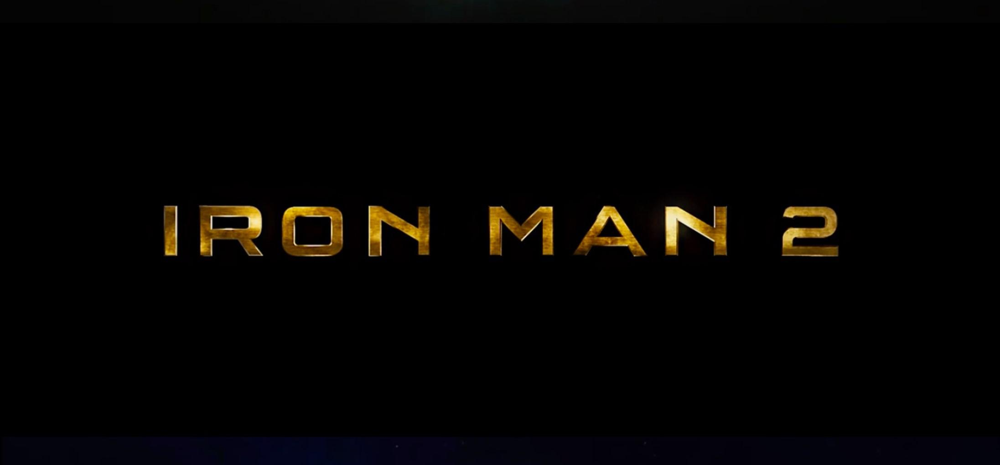

### 7. Iron Man 2

Of the three Iron Men, I think the second outing is the one where the pieces really come together. That may come as a surprise since this is widely considered the worst of the three. When I re-watched it, everything clicked. On one hand, you have a Tony who is finally a human. He's imperfect and dealing with that through the film. You've got a great pair of villains in Rourke and Rockwell (who are great on their own but excel together). This is also the intro of Senator Stern (the Ted Cruz of the MCU), a character I love to hate. It introduces Nick Fury and the Black Widow (the latter of whom spends the first half pretending to be Stark's assistant, which leads into a great reveal). Later, she helps Pepper (who is an actual character finally). Furthermore, they delve into the theme of accountability, which is important throughout the rest of the MCU. The action continues to be good, but we don't spend any time in a cave. Instead, we get functional suits, big set pieces, the Roadie we deserve (Don Cheadle), and a satisfying package.

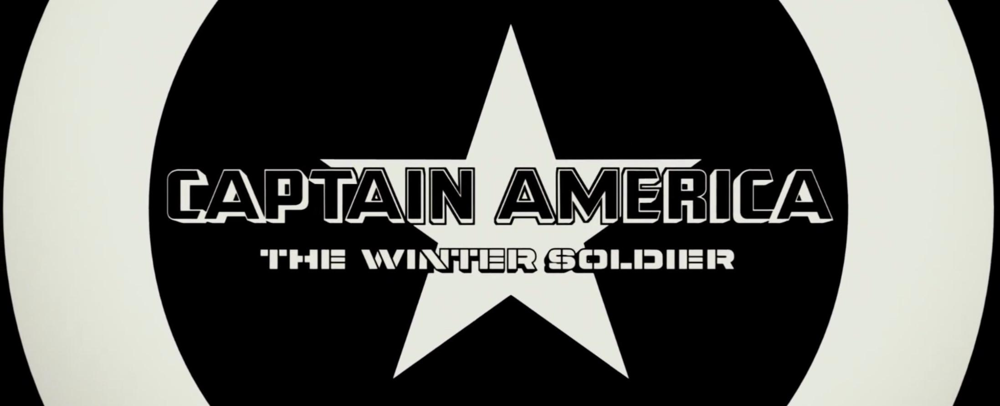

### 6. Captain America: The Winter Soldier

There's a lot going for _Winter Soldier_. There's no need to build Cap from scratch, so we get an opening scene of him running (literal) circles around mere mortals. We get Fury being an actual character and Widow with a lot of screen time. She and Cap have good chemistry, so it's refreshing to see them get to do some actual sleuthing. The Winter Soldier is frightening and capable. Robert Redford and his surveillance state is a surprisingly relevant message, even 4 years after the movie was originally released. Despite being buildup to _Civil War_ (though we didn't know it at the time), this movie stands on its own legs as an engaging thriller that effectively sets up some of the moral quandaries that show up later.

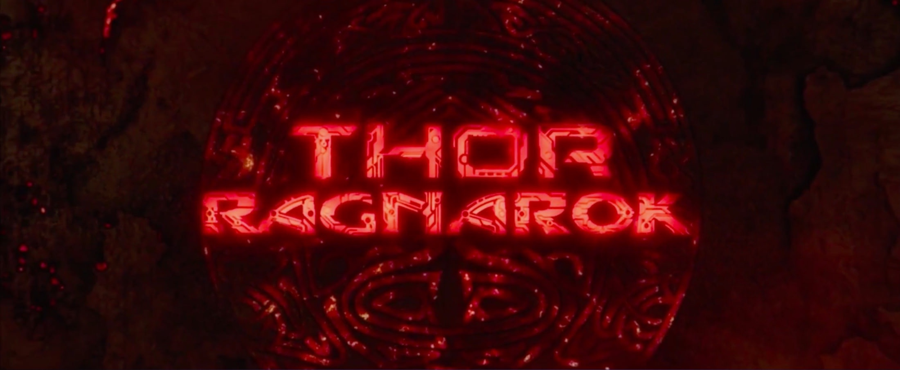

### 5. Thor: Ragnarok

It's hard to say what went so _right_ here. My only guess is that Marvel looked at the trash heap that was Thor 2 and "let's do something completely different". And different they did! Harnessing the comedy genius of Taika Waititi, to throw all of the seriousness out the window and lean into the humor from the first movie. As it is said, "To be born again, first you have to die". They take his cape, his hair, and his hammer. What's left is the funniest Marvel movie there's ever been. The humor is light and moves quickly; it drags remarkably little for a 2 hour movie. Goldblum is a great addition to the tone of the characters. The Asgard/Hela part of the plot is fine, but does give some cool actions. Cinematograhpically, this movie knocks it out of the park. I think it's second only to _Black Panther_ for art design and sets. My biggest disappointment was that they didn't use AC/DC's _Thunderstruck_ during the climax, but it's hard to go wrong with _The Immigrant Song_.

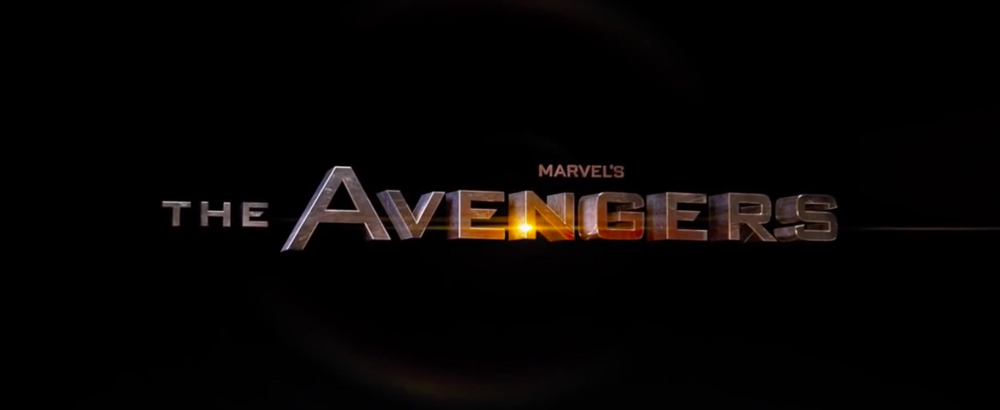

### 4. The Avengers

_Avengers_ is greater than the sum of its parts and was for a long time, the best Marvel had to offer. Like a lot of the other intro-heavy movies, there's a lot of setup before we get to the meat of the movie. It's done well, with each character intro feeling distinct. The play between each team member feels fun. This is also the first time we get Ruffalo's Hulk, who is a breath of fresh air on an otherwise tough character. He doesn't transform until 1:15, so there's a lot of anticipation. His CGI is much more expressive, which helps him be a character both in and out of green mode. Loki is a great enemy who is equal parts cunning and powerful. The climactic fight through Manhattan is a string of compelling vignettes that tie together well. Also, Coulson's death (while partially expected [^3]), never stops hurting.

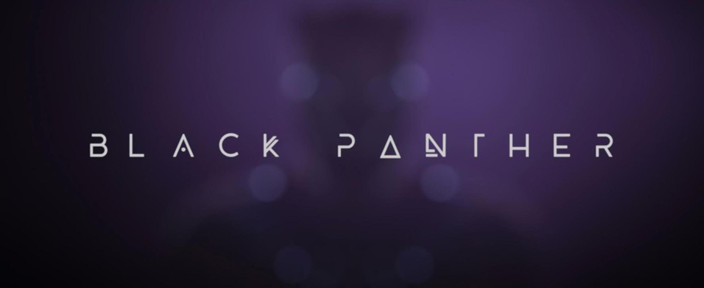

### 3. Black Panther

On the surface, _Black Panther_ shares a lot in common with _Thor_. It's a self-contained story about a ruler who has to come into his rule and there's a lot of world-building. The biggest difference is that this one is _phenomenal_. The supporting cast (Nyong'o, Gurira, Freeman, and Wright) have a great balance between humor and action. They play off each other exceedingly well and feel realistic and human. Michael B Jordan's Killmonger is the most menacing, driven, sympathetic, and threatening villain in the entire MCU. The art direction is unparalleled; every piece of this movie from the costumes to the environments is gorgeous. The biggest knocks against it are some of the hokier scenes (Lion King-esque conversation and when the sister does her Q impression from the _007_ series) and basically all details involving vibranium, but that can't do much to stop this mag-lev train from rolling toward the top of my list.

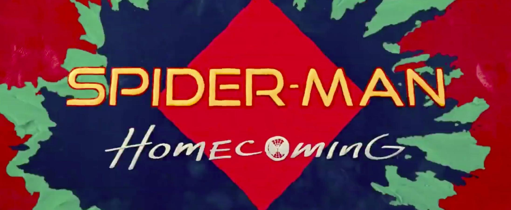

### 2. Spider-Man: Homecoming

The third time really is the charm. We finally got a Spider-Man movie that didn't spend time killing Uncle Ben, instead replacing it with a great sequence about _Civil War_ from Peter's point of view. The action is good, the villain is menacing, and the jokes are there. In fact, I think what impressed me most is how funny the supporting cast of high schoolers is without being annoying or overpowering. They all feel like actual high school students, which adds a lot to the environment. I still think Vulture being his lady friend's dad is a phenomenal reveal and the car ride he takes them on is stress I haven't felt since _Get Out_. _Spider-Man_ is everything a Marvel movie should be and I look forward to what they do with him next.

_I also wrote about **Spider-Man** in my 2017 lookback [here](/blog/post/a-few-more-favorites/#movies)_.

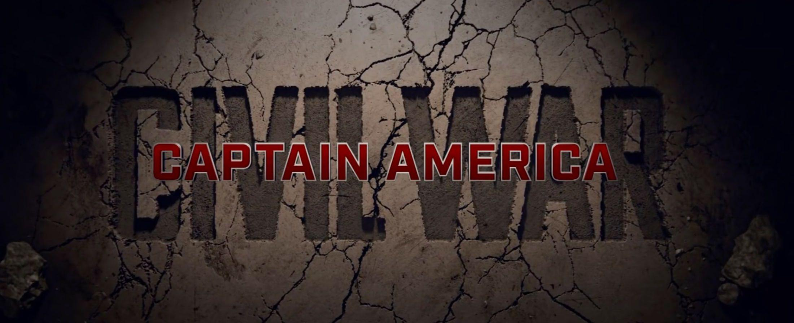

### 1. Captain America: Civil War

Captain America is the poster boy for a series getting better over time. It's no small feat to construct a movie that's both so action packed and so emotionally impactful. Though Zemo is clearly the villain, the writers do an exceptional job painting basically everyone as antagonists at some point. The viewpoints of each side of the Accords are well-presented and justified. The anxiety over seeing "parents" fight and neither side being purely right is tough, but rewarding. The airport fight brings a lot of characters together and is satisfying. Spidey and Ant Man have a chance to be funny without getting in the way, and each sequence feels important. The beats in the last half hour of the movie (Roadie getting injured, Stark putting his friends in jail, the reveal about who killed the Starks) are up there with _Logan_, redefining drama's place in the superhero genre. The climax with Bucky, Cap, and Stark beating the pulp out of each other feels so raw and driven that it's impossible to root for either too heavily. Everything about this movie excels, and that makes it, in my opinion, the single best Marvel movie.

_I also wrote about **Civil War** in my 2016 lookback [here](/blog/post/a-few-of-my-favorite-things/#movies)_.

## Onward

Watching all these movies has been a blast and a half and I'm really excited about _Infinity War_. These movies are the most ambitious cinematic undertaking in history and the fact that they've grown this universe over the past 10 years is really astounding.

If you want to play with some of this data, look no farther than [this airtable](https://airtable.com/shrlXSYnmHDqOCi11), which will let you sort, filter, and group all of my rankings. It also has the stream-of-consciousness notes I took while watching if you're interested in reading a weird play-by-play of each one.

Anyway, that's all I've got today. Thanks for reading and go enjoy the movie!

_Big thanks to [/u/Ragerodracir](https://www.reddit.com/r/marvelstudios/comments/8b639o/all_18_title_cards_as_they_appear_in_the_movies/) on Reddit for collecting all of the title card images and the inimitable [Vicky](https://vickystein.media/) for editing this post, watching all these movies with me, and generally putting up with me._

[^1]: AKA insertion sort
[^2]: just acting, no action
[^3]: _Avengers_ director Joss Whedon always kills someone in his films. Why does he kill the ones we love the most? Maybe it's because [we love stupid people](https://www.reddit.com/r/IAmA/comments/s2uh1/i_am_joss_whedon_ama/c4ani27/?context=3)
